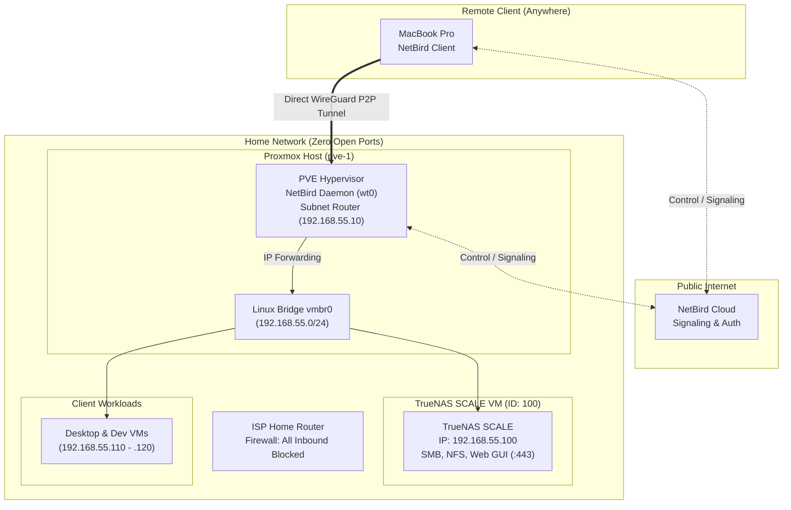

# NetBird Remote Access & Subnet Routing

This runbook documents the secure, zero-inbound-port remote access mesh configured for the homelab using **NetBird Cloud**.

---

## 1. Overview & Architecture

- **Control Plane**: NetBird Cloud ([app.netbird.io](https://app.netbird.io))
- **Data Plane**: WireGuard P2P direct encrypted tunnels
- **Inbound Router Ports**: **Zero** (no port forwarding, NAT traversal via STUN/TURN/ICE)
- **Routing Peer**: Bare-metal **Proxmox VE Host (`pve-1`)**
- **Forwarded Subnet**: `192.168.55.0/24` (Masquerade / NAT enabled)



---

## 2. Host Configuration on Proxmox VE (`pve-1`)

### A. IP Forwarding
Configured in `/etc/sysctl.d/99-netbird.conf`:
```text
net.ipv4.ip_forward = 1
```

### B. Client Service
NetBird runs as a systemd service managed by `systemctl`:
```bash
# Check status
systemctl status netbird

# Status & peer connections
netbird status
```

---

## 3. NetBird Cloud Network Route Configuration

In **[app.netbird.io](https://app.netbird.io)** $\rightarrow$ **Network Routes**:
- **Network ID**: `homelab-subnet`
- **Network Range**: `192.168.55.0/24`
- **Routing Peer**: `pve-1`
- **Masquerade**: Enabled (Checked)
- **Distribution Groups**: `All` (or your user/admin group)

---

## 4. Verification & Testing

From your MacBook outside the home network:
1. Connect to NetBird in the macOS menu bar app.
2. Access services via their private FQDN:
   - **Proxmox VE**: `https://pve-1.home.sinsamersuk.net:8006`
   - **TrueNAS SCALE**: `https://truenas.home.sinsamersuk.net`
   - **SSH**: `ssh root@192.168.55.10`
   - **SMB / Time Machine**: `smb://truenas.home.sinsamersuk.net`
