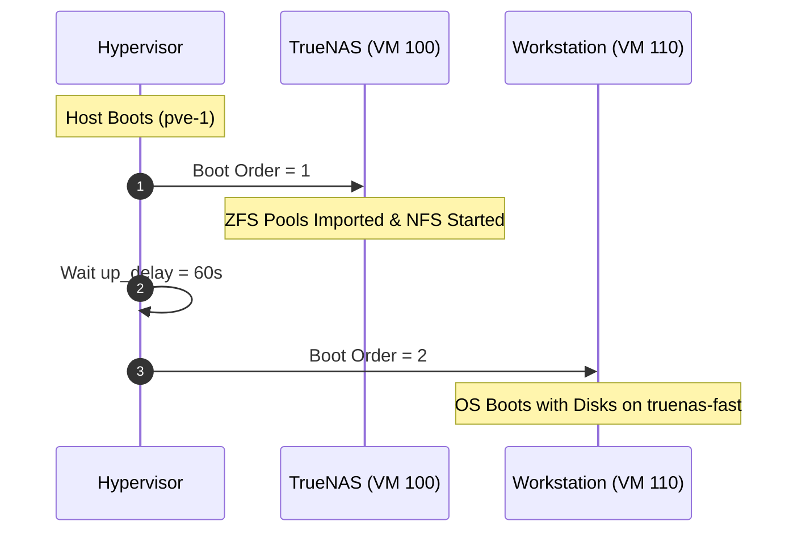

# Proxmox VE Hypervisor Configuration & Architecture

This document details the configuration, hardware passthrough, networking, and storage integration for the primary homelab hypervisor node **`pve-1`**.

---

## 1. Node Specifications & Core Architecture

* **Hostname**: `pve-1` (`pve-1.home.sinsamersuk.net` $\rightarrow$ `192.168.55.10`)
* **Hardware Profile**:
  * **CPU**: Intel Core (Raptor Lake, 14–20 vCPUs)
  * **Memory**: 128 GB DDR5 RAM
  * **Motherboard Storage Controller**: Intel Raptor Lake SATA Controller (`0000:00:17.0`)
  * **Host Boot Drive**: Apacer AS2280P4 256GB NVMe (`0000:02:00.0`, `nvme0n1`)
  * **Dedicated Fast NVMe**: PNY CS3030 2TB NVMe (`0000:03:00.0`, `nvme1n1`, Phison E12)
* **Kernel & Virtualization**: Linux kernel with Intel VT-x and VT-d (IOMMU) enabled.

---

## 2. PCIe Resource Mappings & IOMMU Isolation

Physical storage controllers are isolated and passed through directly to storage appliances using Proxmox Resource Mappings. This grants the guest operating system native, bare-metal hardware control.

| Resource Mapping | PCI Address | Hardware Vendor/Device ID | IOMMU Group | Guest Target | Purpose |
| :--- | :--- | :--- | :--- | :--- | :--- |
| **`sata-controller`** | `0000:00:17.0` | `8086:7a62` | Group 14 | TrueNAS (`hostpci0`) | Direct ZFS control over all SATA HDDs |
| **`nvme-fast-storage`** | `0000:03:00.0` | `1987:5012` | Group 17 | TrueNAS (`hostpci1`) | Fast NVMe pool for VM disks & containers |

> [!IMPORTANT]
> The host boot drive (`0000:02:00.0` Apacer 256GB NVMe) remains on the hypervisor to provide the Proxmox OS root partition and `local-lvm` for hypervisor virtual boot drives.

Declarative Terraform mapping in [`terraform/proxmox/hardware.tf`](file:///Users/akraradets/Projects/sinsamersuk/homelab/terraform/proxmox/hardware.tf):
```hcl
resource "proxmox_virtual_environment_hardware_mapping_pci" "sata_controller" {
  name        = "sata-controller"
  description = "Intel Raptor Lake SATA Controller (0000:00:17.0)"
  map = [{
    node = "pve-1"
    path = "0000:00:17.0"
    id   = "8086:7a62"
  }]
}

resource "proxmox_virtual_environment_hardware_mapping_pci" "nvme_fast_storage" {
  name        = "nvme-fast-storage"
  description = "PNY CS3030 2TB NVMe SSD (0000:03:00.0)"
  map = [{
    node = "pve-1"
    path = "0000:03:00.0"
    id   = "1987:5012"
  }]
}
```

---

## 3. Hypervisor Storage Datastores

Storage datastores configured under **Datacenter $\rightarrow$ Storage**:

| Datastore ID | Storage Type | Source / Mount | Content Types | Shared? | Role |
| :--- | :--- | :--- | :--- | :--- | :--- |
| **`truenas-fast`** | NFS | `192.168.55.100:/mnt/pool-fast/vms` | `Disk image`, `Container` | **Yes** | Primary VM disks and container root filesystems |
| **`truenas-proxmox`** | NFS | `192.168.55.100:/mnt/pool-2/proxmox` | `ISO image`, `Import`, `VZTmpl`, `Backup` | **Yes** | ISO catalog, cloud image downloads, VM backups |
| **`local-lvm`** | LVM-Thin | `/dev/pve/data` (Apacer 256GB) | `Disk image`, `Container` | No | TrueNAS appliance boot disk (`scsi0` 32GB) |
| **`local`** | Directory | `/var/lib/vz` | *Disabled* | No | Disabled to prevent root partition capacity exhaustion |

### Why `Shared: Checked` on `truenas-fast`?
By marking the NFS datastore as **Shared**, Proxmox enables live VM migration between cluster nodes without requiring virtual disks to be copied over the network.

---

## 4. Virtual Networking & Throughput Optimization

* **Linux Bridge (`vmbr0`)**: Connects physical Gigabit LAN (`192.168.55.0/24`) to VMs and containers.
* **Internal VM-to-VM Bandwidth**:
  * VM-to-VM traffic (such as client VMs accessing TrueNAS NFS shares over `vmbr0`) bypasses physical network cables and flows entirely through host RAM.
  * Measured throughput: **~15–25+ Gbps**.
* **NIC Tuning for Storage**:
  * VirtIO NIC model with `queues = 4` (multiqueue distributes packet handling across multiple vCPUs).
  * `firewall = false` on internal storage bridges to eliminate netfilter packet inspection overhead.

---

## 5. Startup & Shutdown Sequencing

To prevent client VMs from experiencing disk timeouts when accessing TrueNAS NFS shares, VM boot and shutdown dependencies are enforced:



* **Boot Rules**:
  * TrueNAS SCALE (`vm_id = 100`): `order = 1`, `up_delay = 60`, `down_delay = 60`.
  * Dependent VMs (`vm_id = 110`): `order = 2`, `up_delay = 0`.
* **Shutdown Rules**:
  * Dependent VMs halt first (`order = 2`).
  * TrueNAS halts last (`order = 1`), guaranteeing zero filesystem corruption on guest virtual disks.

---

## 6. Declarative Cloud-Init & API-Native Provisioning

VMs are provisioned using **pure Proxmox API tokens** (`PVEAPIToken`) with **zero hypervisor SSH requirements**:

1. **Cloud Image Download**:
   * Images are downloaded to `truenas-proxmox` using `content_type = "import"` and file extension **`.qcow2`**.
   * Example: `noble-server-cloudimg-amd64.qcow2`.
2. **API-Native Disk Import**:
   * Use `import_from = proxmox_virtual_environment_download_file.<name>.id` directly inside the `disk` block.
   * Proxmox's native REST API handles the conversion and allocation onto `truenas-fast` without SSH `qm disk import` commands.
3. **Cloud-Init Configuration**:
   * Configured via native `initialization` block in Terraform.
   * Injects standardized identity (`akraradets`, UID 3000) and authorized ed25519 SSH keys.

---

## 7. Proxmox ACME SSL Certificates

Proxmox Web GUI (`https://192.168.55.10:8006`) uses Let's Encrypt certificates automatically validated via GCP Cloud DNS:
* **Account**: `root@sinsamersuk.net`
* **Plugin**: DNS-01 via GCP Cloud DNS API (`roles/dns.admin`)
* **Service Account**: `pve-acme@sinsamersuk.iam.gserviceaccount.com` (key at `terraform/gcp/pve-acme-sa.json`)
* **Domain**: `pve-1.home.sinsamersuk.net`
