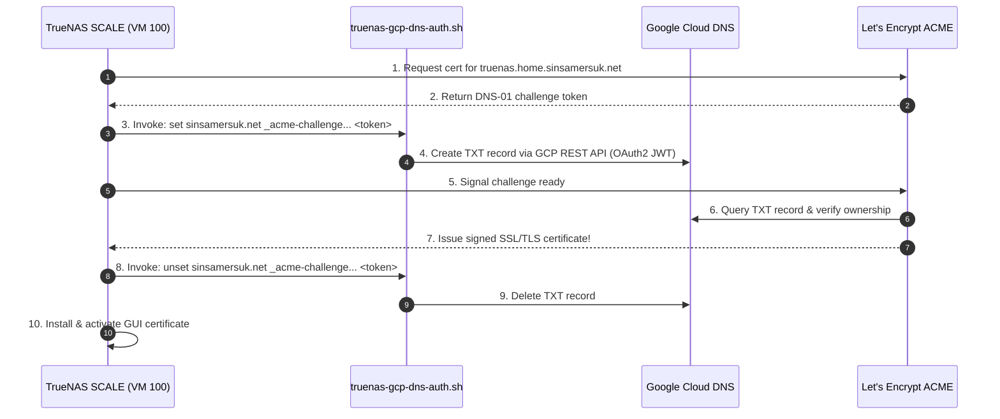

# TrueNAS SCALE ACME DNS-01 SSL with Google Cloud DNS

This runbook documents the automated, zero-inbound-port SSL/TLS certificate setup for **TrueNAS SCALE** running on Proxmox VE.

---

## 1. Overview & Architecture

- **Domain**: `truenas.home.sinsamersuk.net`
- **Private IP**: `192.168.55.100` (on `vmbr0`)
- **DNS Provider**: Google Cloud DNS (`sinsamersuk-net` managed zone)
- **Certificate Authority**: Let's Encrypt (Production)
- **Challenge Type**: **DNS-01** (Zero open inbound router ports required)
- **Automation**: Fully automated lifecycle (issuance + 60-day auto-renewal managed directly by TrueNAS).



---

## 2. Persistent Authenticator Setup

Because TrueNAS SCALE enforces storing custom scripts on a persistent ZFS pool, the script and credentials reside on `pool-1`:

- **Script Path**: `/mnt/pool-1/scripts/acme/truenas-gcp-dns-auth.sh`
- **Key Path**: `/mnt/pool-1/scripts/acme/gcp-sa.json`

> [!NOTE]
> The shell authenticator [`scripts/truenas-gcp-dns-auth.sh`](../scripts/truenas-gcp-dns-auth.sh) is self-contained. It uses built-in Linux utilities (`bash`, `curl`, `openssl`, and standard `python3`) to sign a JWT and interact directly with Google Cloud DNS REST API. Zero extra packages (`gcloud` SDK, `pip`, or `jq`) are required.

---

## 3. Configuration in TrueNAS Web GUI

### Step 1: ACME DNS-01 Authenticator
1. Navigate to: **Credentials** $\rightarrow$ **Certificates**.
2. Under **ACME DNS-Authenticators**, click **Add**:
   - **Authenticator**: `Shell`
   - **Name**: `gcp-dns-auth`
   - **Path to Script**: `/mnt/pool-1/scripts/acme/truenas-gcp-dns-auth.sh`
   - **Running User**: `root`
   - **Certificate Timeout**: `120`
   - **Domain Propagation Delay**: `30`
3. Click **Save**.

### Step 2: Certificate Signing Request (CSR) & Issuance
1. Under **Certificate Signing Requests**, click **Add**:
   - **Identifier**: `truenas-csr`
   - **Common Name**: `truenas.home.sinsamersuk.net`
   - Click **Save**.
2. In the CSR list, click the **wrench icon** (or 3-dots $\rightarrow$ **Create ACME Certificate**):
   - **Identifier**: `truenas-cert`
   - **Terms of Service**: Check the box to accept.
   - **Authenticator**: Select `gcp-dns-auth`.
   - **Renew Certificate Days**: `30`.
   - Click **Save**.

### Step 3: Assign to Web GUI
1. Navigate to: **System Settings** $\rightarrow$ **General**.
2. Under **GUI**, click **Settings**.
3. In **GUI SSL/TLS Certificate**, select **`truenas-cert`**.
4. Click **Save** and confirm the web interface restart.

---

## 4. Verification

Verify the live certificate from your local machine:
```bash
curl -Iv https://truenas.home.sinsamersuk.net 2>&1 | grep -E "subject|issuer|verify ok"
```
Output:
```text
*  subject: CN=truenas.home.sinsamersuk.net
*  issuer: C=US; O=Let's Encrypt; CN=YR1
*  SSL certificate verify ok.
```
