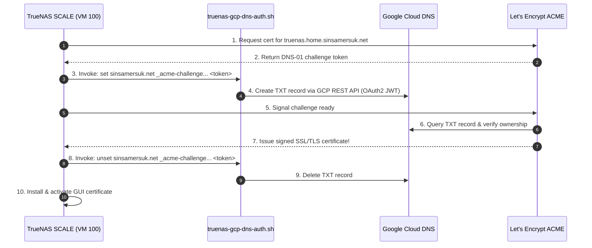

# TrueNAS SCALE Storage Appliance Configuration & Architecture

This document details the configuration, ZFS storage pool design, dataset tuning, sharing services, and automated SSL certificate management for the virtualized **TrueNAS SCALE** appliance (`vm_id = 100`).

---

## 1. Virtual Appliance Architecture & Hardware Passthrough

TrueNAS SCALE runs as a virtualized storage appliance on Proxmox VE (`pve-1`), directly controlling physical disk controllers via PCIe passthrough:

* **VM ID**: `100` (`name: truenas-scale`)
* **Static IP**: `192.168.55.100` (`truenas.home.sinsamersuk.net`)
* **Compute Resources**:
  * **vCPUs**: 4 Cores (Type: `host`)
  * **RAM**: **32,768 MB (32 GB)** Fixed Dedicated Memory
  * **Memory Ballooning**: **Strictly Disabled** (ZFS ARC requires deterministic, non-reclaimable RAM to prevent kernel panics)
* **Firmware & Display**:
  * Machine: `q35`
  * BIOS: `ovmf` (UEFI)
  * Display: `virtio` (VirtIO-GPU with 32MB VRAM fixes text garbling under OVMF console)
* **PCIe Passthrough Devices**:
  * `hostpci0`: Intel Raptor Lake SATA Controller (`0000:00:17.0`) $\rightarrow$ Direct AHCI control of physical SATA ports.
  * `hostpci1`: PNY CS3030 2TB NVMe SSD (`0000:03:00.0`, Phison E12) $\rightarrow$ Direct control of fast NVMe controller.

```mermaid
flowchart TD
    subgraph Host["Proxmox Host (pve-1)"]
        subgraph TrueNAS["TrueNAS SCALE (VM 100)"]
            ZFSFast["ZFS: pool-fast (2TB NVMe)<br/>Dataset: /mnt/pool-fast/vms<br/>sync=disabled"]
            ZFSPool1["ZFS: pool-1 (4TB Mirror)<br/>Datasets: projects, timemachine<br/>sync=standard"]
            ZFSPool2["ZFS: pool-2 (2TB WD Blue)<br/>Dataset: /mnt/pool-2/proxmox<br/>sync=disabled | Spindown"]
            NFSD["NFS Kernel Server (Port 2049)"]
            SMBD["SMB Server (Time Machine & Projects)"]
        end

        VMBR0["Internal Linux Bridge (vmbr0)<br/>RAM-Speed Transfer (15-25+ Gbps)"]
    end

    TrueNAS --> ZFSFast
    TrueNAS --> ZFSPool1
    TrueNAS --> ZFSPool2

    ZFSFast --> NFSD
    ZFSPool2 --> NFSD
    ZFSPool1 --> SMBD

    NFSD -->|NFS Export (truenas-fast)| VMBR0
    NFSD -->|NFS Export (truenas-proxmox)| VMBR0
```

---

## 2. Storage Pool Layout & Specifications

TrueNAS organizes storage into three distinct tiers:

| Pool Name | Physical Drives | Drive Models | Layout / Topology | Purpose | Key Settings |
| :--- | :--- | :--- | :--- | :--- | :--- |
| **`pool-fast`** | 1x 2TB NVMe | PNY CS3030 (`/dev/nvme0n1`) | Single-disk Stripe | Shared VM disks & containers | `sync=disabled`, `atime=off` |
| **`pool-1`** | 2x 4TB HDDs | Seagate IronWolf (`sdb`, `sdc`) | Mirror (`mirror-0`) | Personal files, Git code, Time Machine | `sync=standard`, quotas enforced |
| **`pool-2`** | 1x 2TB HDD | WD Blue 7200 RPM (`sdd`) | Single-disk Stripe | Proxmox ISOs, templates, VM backups | `sync=disabled`, APM 127 + Spindown |

---

## 3. Dataset Tuning & Performance Rationale

### A. Fast VM Disks (`pool-fast/vms`)
* **Path**: `/mnt/pool-fast/vms`
* **Sync Behavior**: **`sync=disabled`**
* **Rationale**:
  * Guest operating systems (ext4 journals, databases) issue frequent `fsync` calls over NFS.
  * Because consumer NVMe SSDs lack enterprise Power Loss Protection (PLP) capacitors, synchronous flushes cause severe latency penalties (dropping write IOPS from ~200,000 down to ~2,000).
  * Setting `sync=disabled` commits writes directly into TrueNAS RAM (ZFS Transaction Groups), flushing asynchronously every 5 seconds.
  * **Result**: Near-memory write speeds (**~15–25+ Gbps**) across the `vmbr0` virtual bridge.
  * **Integrity**: ZFS Copy-on-Write (CoW) guarantees the storage filesystem structure will never corrupt. In an ungraceful host crash, only the last up-to 5 seconds of in-flight VM writes could be lost.

### B. Proxmox Backups & ISOs (`pool-2/proxmox`)
* **Path**: `/mnt/pool-2/proxmox`
* **Sync Behavior**: **`sync=disabled`**
* **Drive Spindown Configuration**:
  * Advanced Power Management (APM): **Level 127** (Permits spindown while keeping drive responsive).
  * Standby Spindown Timer: **20–30 Minutes**.
  * Hardware state verified via: `hdparm -y /dev/sdd` (confirms mechanical platter shutdown when idle).

### C. Projects & Time Machine (`pool-1`)
* **Projects Dataset**: `/mnt/pool-1/projects/akraradets`
  * Owner: `akraradets` (UID 3000)
  * Group: `akraradets` (GID 3000)
  * Permissions: Standard POSIX / NFSv4 ACLs (`755`).
* **Time Machine Dataset**: `/mnt/pool-1/timemachine`
  * Quota: Hard quota enforced (e.g. 1.5 TB) to prevent Apple Time Machine from growing indefinitely and consuming the entire pool.

---

## 4. NFS Shares Configuration

TrueNAS exports storage over NFS to Proxmox and client workloads.

### Export 1: Fast VM Storage
* **Dataset Path**: `/mnt/pool-fast/vms`
* **Description**: `Proxmox Shared VM Storage`
* **Authorized Networks**: `192.168.55.0/24`
* **Advanced Permissions**:
  * **Maproot User**: `root`
  * **Maproot Group**: `root`
  * **Security**: `sys`

### Export 2: Proxmox ISO & Backup Storage
* **Dataset Path**: `/mnt/pool-2/proxmox`
* **Description**: `Proxmox ISO and Backup Storage`
* **Authorized Networks**: `192.168.55.0/24`
* **Advanced Permissions**:
  * **Maproot User**: `root`
  * **Maproot Group**: `root`

---

## 5. SMB Sharing & User Identity Alignment

* **Standardized Identity**:
  * Username: **`akraradets`**
  * UID: **`3000`**
  * Primary Group: **`akraradets`** (GID `3000`)
* **SMB Shares**:
  * **`projects`**: Path `/mnt/pool-1/projects/akraradets` (accessible by macOS workstations and Linux VMs).
  * **`TimeMachine`**: Path `/mnt/pool-1/timemachine` with **Time Machine** multi-user option enabled for automatic macOS Bonjour discovery.

---

## 6. Automated ACME DNS-01 SSL Certificates (Google Cloud DNS)

The TrueNAS Web GUI (`https://192.168.55.100`) uses valid Let's Encrypt SSL/TLS certificates issued and renewed with **zero inbound ports** using ACME DNS-01 challenges and Google Cloud DNS.

### Architecture Flow



### Persistent Authenticator Files
Custom scripts on TrueNAS SCALE reside on persistent storage (`pool-1`):
* **Script Path**: `/mnt/pool-1/scripts/acme/truenas-gcp-dns-auth.sh`
* **Key Path**: `/mnt/pool-1/scripts/acme/gcp-sa.json`

> [!NOTE]
> The shell authenticator [`scripts/truenas-gcp-dns-auth.sh`](file:///Users/akraradets/Projects/sinsamersuk/homelab/scripts/truenas-gcp-dns-auth.sh) is self-contained. It uses built-in Linux utilities (`bash`, `curl`, `openssl`, and standard `python3`) to sign a JWT and interact directly with Google Cloud DNS REST API. Zero extra packages (`gcloud` SDK, `pip`, or `jq`) are required.

### Configuration in TrueNAS Web GUI

#### Step 1: ACME DNS-01 Authenticator
1. Navigate to: **Credentials** $\rightarrow$ **Certificates**.
2. Under **ACME DNS-Authenticators**, click **Add**:
   * **Authenticator**: `Shell`
   * **Name**: `gcp-dns-auth`
   * **Path to Script**: `/mnt/pool-1/scripts/acme/truenas-gcp-dns-auth.sh`
   * **Running User**: `root`
   * **Certificate Timeout**: `120`
   * **Domain Propagation Delay**: `30`
3. Click **Save**.

#### Step 2: Certificate Signing Request (CSR) & Issuance
1. Under **Certificate Signing Requests**, click **Add**:
   * **Identifier**: `truenas-csr`
   * **Common Name**: `truenas.home.sinsamersuk.net`
   * Click **Save**.
2. In the CSR list, click the **wrench icon** (or 3-dots $\rightarrow$ **Create ACME Certificate**):
   * **Identifier**: `truenas-cert`
   * **Terms of Service**: Check the box to accept.
   * **Authenticator**: Select `gcp-dns-auth`.
   * **Renew Certificate Days**: `30`.
   * Click **Save**.

#### Step 3: Assign to Web GUI
1. Navigate to: **System Settings** $\rightarrow$ **General**.
2. Under **GUI**, click **Settings**.
3. In **GUI SSL/TLS Certificate**, select **`truenas-cert`**.
4. Click **Save** and confirm the web interface restart.

### Verification
```bash
curl -Iv https://truenas.home.sinsamersuk.net 2>&1 | grep -E "subject|issuer|verify ok"
```
Output:
```text
*  subject: CN=truenas.home.sinsamersuk.net
*  issuer: C=US; O=Let's Encrypt; CN=YR1
*  SSL certificate verify ok.
```
