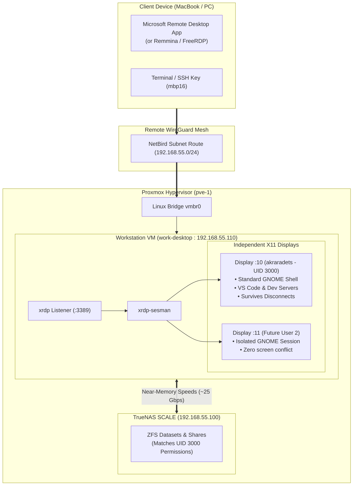

# Ubuntu Desktop Workstation (RDP & Multi-User Architecture)

This runbook documents the configuration, access methods, and persistence architecture of the Ubuntu 24.04 LTS desktop workstation VM (`work-desktop`) running on Proxmox VE.

---

## 1. Overview & Specifications

- **VM ID**: `110` (`work-desktop`)
- **Host**: Proxmox VE 8.x (`pve-1`)
- **OS**: Ubuntu 24.04 LTS (Noble Numbat) via official Cloud Image
- **Desktop Environment**: **Standard Ubuntu GNOME** (Wayland disabled in GDM for X11 compatibility)
- **vCPUs**: 6 cores (host type, Raptor Lake)
- **RAM**: 16 GB dedicated (4 GB ballooning minimum)
- **Disk**: 64 GB NVMe on `local-lvm` (auto-expanded by Cloud-Init)
- **Primary User**: `akraradets`
  - **UID**: `3000` (aligned with TrueNAS SCALE ZFS file ownership)
  - **Groups**: `sudo`, `users`
  - **Default Password**: `ubuntu` (recommended to change on first login)
- **IP Address**: `192.168.55.110/24`
- **DNS / Hostname**: `desktop.home.sinsamersuk.net`
- **Pre-installed Tooling**: VS Code (`code`), Git, Curl, Wget, QEMU Guest Agent, NFS/SMB utilities



---

## 2. Multi-User & Session Persistence Behavior

### How It Compares to TeamViewer & Moonlight
Unlike screen scrapers (TeamViewer, Moonlight, AnyDesk) which mirror the physical display (`:0`):
- **Zero Conflict**: Each user logging in via RDP gets their own virtual X11 display spawned in memory.
- **Privacy**: Other users cannot see your screen or control your mouse.
- **Session Survival**: If you close your RDP client window, your GNOME session, VS Code, and running scripts continue executing in background RAM.
- **Reattachment**: Connecting again with the same username seamlessly re-attaches you to your existing running desktop.

---

## 3. Connecting to the Workstation

### Option A: Microsoft Remote Desktop (macOS / Windows)
1. Install **Windows App** (formerly Microsoft Remote Desktop) from the Mac App Store.
2. Click **Add PC**:
   - **PC Name**: `desktop.home.sinsamersuk.net:3389` (or `192.168.55.110`)
   - **User Account**: Add User Account:
     - **Username**: `akraradets`
     - **Password**: `ubuntu` (or updated password)
   - **Display Settings**: Set resolution to *Native* or enable *Update the session resolution on resize*.
3. Connect!

> [!TIP]
> If connecting remotely outside the house, ensure your **NetBird** client is active. Because `pve-1` routes `192.168.55.0/24`, you can connect to `desktop.home.sinsamersuk.net` anywhere in the world with zero open router ports.

### Option B: Direct SSH
Your MacBook SSH public key is provisioned automatically:
```bash
ssh akraradets@desktop.home.sinsamersuk.net
# or
ssh akraradets@192.168.55.110
```

---

## 4. Mounting TrueNAS Shares on the Desktop

Because `akraradets` is assigned **UID 3000** inside `work-desktop`, file ownership perfectly aligns with TrueNAS ZFS datasets:

### NFS Mount (Fastest)
```bash
sudo mkdir -p /mnt/archive
sudo mount -t nfs 192.168.55.100:/mnt/pool-1/archive /mnt/archive
```

### Automatic Mount via `/etc/fstab`
```ini
192.168.55.100:/mnt/pool-1/archive  /mnt/archive  nfs  defaults,_netdev  0  0
```

---

## 5. Maintenance & Polkit Rules

On standard Ubuntu GNOME, connecting via RDP can trigger authorization dialogs for `colord` or network management. Cloud-Init automatically installs `/etc/polkit-1/rules.d/02-allow-colord.rules` to bypass these prompts for users in group `sudo`.
