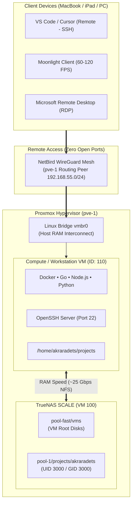

# Workstation & Development Environment Architecture

This runbook documents the compute workstation architecture, user identity alignment, storage integration with TrueNAS SCALE, and the evaluation of remote access protocols for the homelab.

> [!NOTE]
> **Current Lifecycle Status**:
> The `work-desktop` VM (`vm_id = 110`) was wiped from Proxmox and commented out in [`terraform/proxmox/110-work-desktop.tf`](file:///Users/akraradets/Projects/sinsamersuk/homelab/terraform/proxmox/110-work-desktop.tf). Its storage bindings, identity framework (UID 3000), and provisioning scripts are documented below in preparation for the next-generation compute environment.

---

## 1. Core Architecture & Specifications

The homelab compute layer runs virtualized on Proxmox VE (`pve-1`), communicating directly with TrueNAS SCALE (`vm_id = 100`) across the virtual bridge (`vmbr0`) at **near-memory speeds (~15–25+ Gbps)**.

| Parameter | Specification | Architectural Rationale |
| :--- | :--- | :--- |
| **VM ID** | `110` (`work-desktop`) | Standardized VM sequencing (`order = 2`, boots after TrueNAS) |
| **Host Hypervisor** | Proxmox VE 9.2 (`pve-1`) | Intel Core i5-13500 (Raptor Lake, 20 vCPUs, UHD 770 iGPU) |
| **Target OS** | Ubuntu 24.04 LTS (Noble) | Long-term support, broad container & tooling support |
| **Primary User** | `akraradets` | Standard homelab administrator identity |
| **UID / GID** | **`3000` / `3000`** | **Strictly matches TrueNAS ZFS dataset ownership** |
| **Network IP** | `192.168.55.110/24` | Static internal assignment on `vmbr0` |
| **Internal FQDN** | `desktop.home.sinsamersuk.net` | Resolves via internal Cloud DNS |
| **Storage Datastore**| `truenas-fast` (NFS) | High-speed NVMe backed VM disks (`sync=disabled`) |



---

## 2. Remote Access Protocols: Architectural Evaluation

During prototype testing on Ubuntu 24.04, three remote access approaches were evaluated:

### Approach A: Headless Linux Dev VM + VS Code Remote - SSH (Recommended)
* **How It Works**: The VM runs headless with OpenSSH, Docker, and dev toolchains. VS Code or Cursor connects from macOS via the **Remote - SSH** extension over NetBird (`ssh akraradets@desktop.home.sinsamersuk.net`).
* **Why It Is Superior**:
  - **Zero Display Latency**: Editor UI, typing, scrolling, and window management render natively on macOS at full Retina resolution and 120Hz ProMotion.
  - **Zero Codec/Bandwidth Overhead**: Only code diffs and terminal text are sent over the network; zero video streaming or compression artifacts.
  - **Native Battery Life**: No video decoders active on the client laptop.
  - **Compute Offload**: Heavy compilation, Docker containers, and test suites execute on the 14-core Intel i5-13500 hypervisor.

### Approach B: Sunshine + Moonlight (High-Performance GUI)
* **How It Works**: A full desktop environment runs with [Sunshine](https://github.com/LizardByte/Sunshine) encoding the screen via the host's Intel UHD Graphics 770 (Quick Sync Video) and streaming to the [Moonlight](https://moonlight-stream.org/) client.
* **Key Findings**:
  - Requires hardware video encoding (`/dev/dri/renderD128` passed through from Proxmox) to achieve smooth 60–120 FPS.
  - Significantly outperforms RDP for fluid window dragging, animations, and graphical applications.
  - Best suited when a complete Linux GUI desktop (browser, IDE, GUI tools) is required on a non-Linux client.

### Approach C: Traditional XRDP / Microsoft Remote Desktop (Evaluated & Retired)
* **How It Works**: `xrdp` and `xrdp-sesman` spawn virtual X11 displays (`:10`) on user login.
* **Why It Was Retired**:
  - **CPU Rasterization**: Cloud images running without dedicated virtual GPU acceleration render GNOME via software (`llvmpipe`), causing sluggish 10–15 FPS refresh rates and high CPU usage.
  - **NetBird Web Client Latency**: Accessing RDP via the NetBird web browser dashboard routes through cloud TURN/relay proxies and HTML5 canvas rendering, resulting in ~200ms latency.
  - **Polkit & Session Complexity**: Multiple background authorization prompts (`colord`, `NetworkManager`) require custom polkit rules.

---

## 3. Storage Integration & Identity Alignment (UID 3000)

To prevent permission mismatch between the Linux workstation and TrueNAS ZFS storage, permissions are bound by a unified POSIX identity:

* **Username**: `akraradets`
* **UID**: `3000`
* **GID**: `3000`

### TrueNAS NFS Mount Configuration

The projects dataset on TrueNAS is exported to `192.168.55.0/24` and mounted directly into the workstation user's home directory.

#### 1. Manual Verification Mount
```bash
sudo mkdir -p /home/akraradets/projects
sudo mount -t nfs -o vers=4,proto=tcp 192.168.55.100:/mnt/pool-1/projects/akraradets /home/akraradets/projects
```

#### 2. Persistent Configuration (`/etc/fstab`)
```ini
# TrueNAS High-Speed Virtual Bridge NFS Export
192.168.55.100:/mnt/pool-1/projects/akraradets  /home/akraradets/projects  nfs  defaults,_netdev,x-systemd.automount,nfsvers=4  0  0
```

Because traffic travels over the virtual bridge (`vmbr0`) entirely in RAM, file reads and writes execute with near-NVMe throughput (~15–25+ Gbps).

---

## 4. Automated Workstation Provisioning

The repository includes an idempotent setup script at [`scripts/setup-workstation.sh`](file:///Users/akraradets/Projects/sinsamersuk/homelab/scripts/setup-workstation.sh). It automates post-installation configuration:

1. **User Identity**: Ensures `akraradets` exists with UID `3000`, GID `3000`, passwordless sudo, and installs the authorized SSH public key.
2. **TrueNAS NFS Storage**: Creates `/home/akraradets/projects` and registers the `/etc/fstab` automount.
3. **Docker Engine**: Installs official Docker CE, Compose, and appends `akraradets` to the `docker` group.
4. **Development Tooling**: Installs Git, Curl, Wget, Build-Essential, and VS Code.
5. **NetBird Client**: Installs official `netbird` package for direct mesh connectivity.

To run on a freshly deployed VM:
```bash
scp scripts/setup-workstation.sh ubuntu@192.168.55.110:/tmp/
ssh ubuntu@192.168.55.110 "sudo bash /tmp/setup-workstation.sh"
```

---

## 5. Related Documentation

- [[architecture|Homelab Architecture]]: Complete system topology, networking, and DNS runbook.
- [[proxmox|Proxmox VE Hypervisor]]: Hardware specs, PCIe passthrough, and VM startup sequencing.
- [[truenas|TrueNAS SCALE Storage]]: ZFS pool layout, fast NVMe dataset tuning, and NFS exports.
- [[netbird|NetBird Remote Access]]: Subnet router configuration and WireGuard peer mesh.
