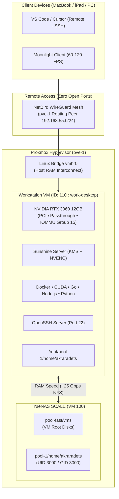

# Workstation & Development Environment Architecture

This runbook documents the consolidated workstation architecture (`work-desktop`, `vm_id = 110`), user identity alignment, storage integration with TrueNAS SCALE, and dual-mode remote access (VS Code Remote - SSH + Sunshine/Moonlight GPU streaming).

---

## 1. Core Architecture & Specifications

All development, container, CUDA/AI, and desktop GUI workloads are consolidated onto a single virtualized workstation (`work-desktop`, `vm_id = 110`) on Proxmox VE (`pve-1`), communicating directly with TrueNAS SCALE (`vm_id = 100`) across the virtual bridge (`vmbr0`) at **near-memory speeds (~15–25+ Gbps)**.

| Parameter | Specification | Architectural Rationale |
| :--- | :--- | :--- |
| **VM ID** | `110` (`work-desktop`) | Standardized VM sequencing (`order = 2`, boots after TrueNAS) |
| **Host Hypervisor** | Proxmox VE (`pve-1`) | Intel Core i5-13500 (Raptor Lake, 20 vCPUs) |
| **Guest vCPUs & RAM** | `8 Cores` (`host`) / `32 GB RAM` | Dedicated compute for containers, compilation, and desktop apps |
| **GPU Passthrough** | **NVIDIA GeForce RTX 3060 12GB** | PCIe `0000:01:00.0` (IOMMU Group 15), CUDA 13.2 & NVENC 7th Gen |
| **Target OS** | Ubuntu 26.04 LTS Desktop | Native Wayland desktop, official NVIDIA Open Kernel drivers (`595.x`) |
| **Primary User** | `akraradets` | Standard homelab administrator identity |
| **UID / GID** | **`3000` / `3000`** | **Strictly matches TrueNAS ZFS dataset ownership** |
| **Network IP** | `192.168.55.110/24` | Static internal assignment on `vmbr0` |
| **Internal FQDN** | `desktop.home.sinsamersuk.net` | Resolves via internal Cloud DNS (`ssh home-workdesktop`) |
| **Storage Datastore**| `truenas-fast` (250 GB NVMe) | High-speed NVMe backed VM disk (`sync=disabled`) |


```mermaid
flowchart TD
    subgraph Client ["Client Devices (MacBook / iPad / PC)"]
        VSCode["VS Code / Cursor (Remote - SSH)"]
        Moonlight["Moonlight Client (60-120 FPS)"]
    end

    subgraph RemoteMesh ["Remote Access (Zero Open Ports)"]
        NetBird["NetBird WireGuard Mesh\n(pve-1 Routing Peer 192.168.55.0/24)"]
    end

    subgraph PVE ["Proxmox Hypervisor (pve-1)"]
        VMBR["Linux Bridge vmbr0\n(Host RAM Interconnect)"]
        
        subgraph ComputeVM ["Workstation VM (ID: 110 : work-desktop)"]
            RTX["NVIDIA RTX 3060 12GB\n(PCIe Passthrough • IOMMU Group 15)"]
            Sunshine["Sunshine Server (KMS + NVENC)"]
            DevTools["Docker • CUDA • Go • Node.js • Python"]
            SSHD["OpenSSH Server (Port 22)"]
            MountPoint["/mnt/pool-1/home/akraradets"]
        end

        subgraph StorageVM ["TrueNAS SCALE (VM 100)"]
            ZFSFast["pool-fast/vms\n(VM Root Disks)"]
            ZFSProjects["pool-1/home/akraradets\n(UID 3000 / GID 3000)"]
        end
    end

    Client ==> NetBird
    NetBird ==> VMBR
    VMBR --> ComputeVM
    ComputeVM <== "RAM Speed (~25 Gbps NFS)" ==> StorageVM
```

---

## 2. Remote Access Protocols: Dual-Mode Workflow

Rather than splitting workloads across separate desktop and headless compute VMs, `work-desktop` (`vm_id = 110`) supports two complementary remote access workflows simultaneously:

### Workflow A: VS Code / Cursor Remote - SSH (Daily Development & AI/CUDA)
* **How It Works**: VS Code or Cursor connects from macOS via **Remote - SSH** (`ssh home-workdesktop` / `desktop.home.sinsamersuk.net`).
* **Why It Excels for Coding**:
  - **Zero Display Latency**: Editor UI, typing, scrolling, and window management render natively on macOS at full Retina resolution and 120Hz ProMotion.
  - **Zero Codec/Bandwidth Overhead**: Only code diffs and terminal text traverse the network.
  - **Direct GPU & Container Access**: Terminal sessions, Docker containers, and CUDA workloads have direct access to the passed-through **NVIDIA GeForce RTX 3060 12GB** (`nvidia-smi`).

### Workflow B: Sunshine + Moonlight with NVIDIA NVENC (Full GUI Desktop)
* **How It Works**: High-performance full desktop streaming using [Sunshine](https://github.com/LizardByte/Sunshine) (running as a systemd system service with KMS capture) paired with the [Moonlight](https://moonlight-stream.org/) client.
* **Hardware Acceleration**: Dedicated **NVIDIA GeForce RTX 3060 12GB** (`0000:01:00.0`, IOMMU Group 15) using **NVENC (`h264_nvenc` / `hevc_nvenc`)** hardware encoding with `vga = "none"` (pure NVIDIA output). See [[sunshine|Sunshine GUI Streaming Runbook]].
* **Why Intel UHD 770 iGPU Was Retired**:
  - Intel Core i5-13500 integrated graphics (`0000:00:02.0`) is locked in **IOMMU Group 0** alongside the CPU Host Bridge memory controller, suffers from driver contention with the Proxmox host kernel, and lacks PCIe FLR (Function-Level Reset), causing VM and hypervisor kernel lockups.
  - The Intel iGPU is no longer used; GPU passthrough is standardized exclusively on the dedicated NVIDIA RTX 3060 12GB on `work-desktop`.

### Retired Approach: Traditional XRDP / Microsoft Remote Desktop
* **Why It Was Retired**:
  - Software CPU rasterization (`llvmpipe`) and Polkit session prompts made XRDP sluggish compared to native NVENC streaming via Sunshine + Moonlight.

---

## 3. Storage Integration & Identity Alignment (UID 3000)

To prevent permission mismatch between the Linux workstation and TrueNAS ZFS storage, permissions are bound by a unified POSIX identity:

* **Username**: `akraradets`
* **UID**: `3000`
* **GID**: `3000`

### TrueNAS NFS Mount Configuration (1:1 Path Parity)

To ensure zero cognitive friction across all systems, TrueNAS paths are mounted with exact 1:1 path parity on all client nodes:

#### 1. Persistent Configuration (`/etc/fstab`)
```ini
# TrueNAS High-Speed Virtual Bridge NFS Export (1:1 Path Parity)
192.168.55.100:/mnt/pool-1/home  /mnt/pool-1/home  nfs  defaults,_netdev,bg,intr,noatime,nfsvers=4  0  0
```

#### 2. Local User Symlinks
To keep local `$HOME` on fast NVMe storage while centralizing credentials and code:
- `~/.ssh` $\rightarrow$ `/mnt/pool-1/home/akraradets/.ssh` (Centralized key pairs, config, authorized_keys)
- `~/projects` $\rightarrow$ `/mnt/pool-1/home/akraradets/projects` (Personal git repos & docker assets)

Because traffic travels over the virtual bridge (`vmbr0`) entirely in host RAM, reads and writes execute with near-memory throughput (~15–25+ Gbps).

---

## 4. Automated Workstation Provisioning

The repository provides two modular, idempotent scripts to provision compute nodes:

### Step 1: Base Machine Setup (`scripts/setup-workstation.sh`)
Automates machine-level essentials (runs once per node):
1. **OpenSSH Server & QEMU Guest Agent**: Installs and activates `openssh-server` and `qemu-guest-agent`.
2. **TrueNAS Storage**: Mounts `/mnt/pool-1/home` with 1:1 path parity in `/etc/fstab`.
3. **Docker Engine**: Installs official Docker CE, Compose plugin, and prepares Docker daemon.

```bash
scp scripts/setup-workstation.sh <bootstrap-user>@192.168.55.110:/tmp/
ssh <bootstrap-user>@192.168.55.110 "sudo bash /tmp/setup-workstation.sh"
```

### Step 2: User Account Creation (`scripts/setup-user.sh`)
Creates and aligns the user account:
1. **Interactive Prompt**: Prompts for `username` and `UID:GID` (defaults: `akraradets` and `3000:3000`), or accepts arguments `[username] [uid:gid]`.
2. **Identity Alignment**: Creates or migrates user and primary group to the specified `UID:GID`.
3. **Hardware & System Groups**: Adds user to `sudo`, `docker`, `video`, `render` (`/dev/dri/renderD128` GPU access), and `input` (Sunshine/Moonlight).
4. **Passwordless Sudo**: Configures validated `/etc/sudoers.d/<username>`.

```bash
# Run interactively (prompts for username and uid:gid)
scp scripts/setup-user.sh <bootstrap-user>@192.168.55.110:/tmp/
ssh -t <bootstrap-user>@192.168.55.110 "sudo bash /tmp/setup-user.sh"

# Or pass arguments directly
ssh <bootstrap-user>@192.168.55.110 "sudo bash /tmp/setup-user.sh akraradets 3000:3000"
```

### Step 3: TrueNAS Vault Linking (Manual Snippet)
Once the user account exists and `/mnt/pool-1/home` is mounted, run the following commands to initialize the vault and create symlinks:

```bash
# 1. Initialize vault directories on TrueNAS (run with sudo)
sudo mkdir -p /mnt/pool-1/home/akraradets/.ssh
sudo mkdir -p /mnt/pool-1/home/akraradets/projects
sudo chown -R 3000:3000 /mnt/pool-1/home/akraradets
sudo chmod 700 /mnt/pool-1/home/akraradets/.ssh

# 2. (Optional) Copy over existing authorized_keys if present
sudo cp ~/.ssh/authorized_keys /mnt/pool-1/home/akraradets/.ssh/ 2>/dev/null || true
sudo chown 3000:3000 /mnt/pool-1/home/akraradets/.ssh/authorized_keys 2>/dev/null || true
sudo chmod 600 /mnt/pool-1/home/akraradets/.ssh/authorized_keys 2>/dev/null || true

# 3. Create persistent symlinks in local home (run as user akraradets)
ln -sfn /mnt/pool-1/home/akraradets/.ssh ~/.ssh
ln -sfn /mnt/pool-1/home/akraradets/projects ~/projects
```

---

## 5. Related Documentation

- [[architecture|Homelab Architecture]]: Complete system topology, networking, and DNS runbook.
- [[proxmox|Proxmox VE Hypervisor]]: Hardware specs, PCIe passthrough, and VM startup sequencing.
- [[truenas|TrueNAS SCALE Storage]]: ZFS pool layout, fast NVMe dataset tuning, and NFS exports.
- [[netbird|NetBird Remote Access]]: Subnet router configuration and WireGuard peer mesh.
